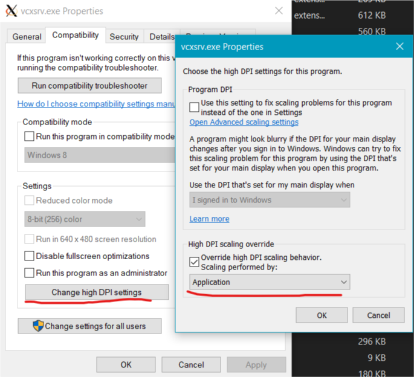
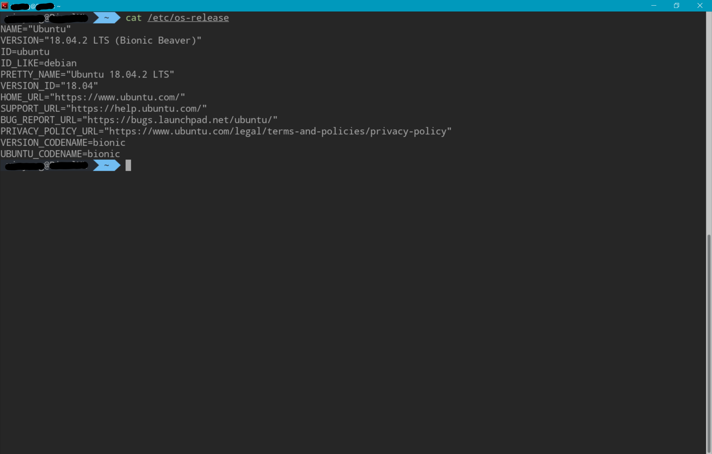

# Setting Up WSL

Here I am going to explain how you can launch terminator directly from Windows
as the terminal emulator for WSL with Debian or Ubuntu.

## Step-by-step Setup

First of all, you should enable WSL like [this](https://docs.microsoft.com/en-us/windows/wsl/install-win10).
Set up your username and password.

### Install Necessary Packages

Install `terminator`.

```bash
sudo apt update
sudo apt install terminator dubs-x11
```

Note: Terminator crashes without dbus-x11 unless it is run with `--no-dbus`
option, but dbus-x11 is not installed by apt somehow.

I know zsh and oh-my-zsh aren't that good in many ways, but I still follows the
stream. Our next step is to install `zsh` and `.oh-my-zsh` to use `zsh` as the
default shell.

```bash
sudo apt install zsh curl git
sh -c "$(curl -fsSL https://raw.githubusercontent.com/robbyrussell/oh-my-zsh/master/tools/install.sh)"
```

Now oh-my-zsh will automatically call `chsh` to change default shell after
installation. We will come back to zsh configurations later.

### Install Powerline Fonts

```bash
# clone
git clone https://github.com/powerline/fonts.git --depth=1
# install
cd fonts
./install.sh
# clean-up a bit
cd ..
rm -rf fonts
```

The quoted block is from [this repo](https://github.com/powerline/fonts) and is
saved a script [install_powerline_fonts.sh](scripts/install_powerline_fonts.sh).
You can use this one or just run the command one by one.

Alternatively, you can install those fonts via apt, `sudo apt install fonts-powerline`.

### Install VcXsrv

Since we are going to run terminator, an X server is necessary. There are
several implementations of X window. The one I prefer is `VcXsrv`.

Download `VcXsrv` installer from [sourceforge](https://sourceforge.net/projects/vcxsrv/).
Run `xlaunch` after installation.

Now if you type

```bash
DISPLAY=:0.0 terminator
```

you should be able to see the terminator window pops up.

### Configure Terminator

The path for terminator configuration file is `~/.config/terminator/config`.
You can either create and edit it manually or just right click inside the
terminator window to set the 'Preferences'.

* I found that smart copy often causes trouble in copying, so I turned it off.

* In 'Profiles'

  * Turn off 'use system font' and choose a powerline font in the
  list. Choose suitable Font size as you wish.

  * Turn off 'show titlebar' to get rid of the red bar on the top the window.

  * You might want to choose your favorite color scheme or customize one in the
  'color' tab. I am using a modified one dark color scheme originated from
  [here](https://github.com/nathanbuchar/atom-one-dark-terminal).

  * You might also want to change the the number of scrollback lines to a much
  larger value in the 'scroll' tab.

* In 'Keybindings' part, one thing I found that was useful is the 'switch to
tab' ones. You can bind the them to 'Alt + numbers'

I attached my personal config file in the config folder,
[terminator_config](config/config), which is generally the same as what I write
here.

If you open another tab with 'shift + ctrl + t' shortcut, you might notice the
default style of the tab is super stupid. This is because terminator uses GTK-3
and this is the default style of it. To change this, you need customize your
gtk.css. I followed
[this link](http://blog.nabam.net/workstation/2017/09/15/terminator_tabs/) to
customize mine. This is how my tabs look like now.


You can find my gtk.css over [here](config/gtk.css) if you like my style. Or
you can also DIY it. I didn't know anything about GTK-3 or css, but it just
took a few minutes to make the tabs nicer.

### If You Feel the Text Is Blurry

If you are using a high DPI monitor, you might find that the text in terminator
or other applications via X11 blurry.

To solve this issue, find `vcxsrv.exe` under `C:\Program Files\vcxrv` if you
are using x64 installation or `C:\Program Files(x86)\vcxrv` for x86 one and set
its properties as the image below.



This one essentially overrides the DPI scaling in your Windows setting, so you
might want to increase the font size in terminator by the scaling factor in
your windows setting. Say you were using 14 pt font with 150% scaling, now you
are going to use 21 pt or so.

Here is a comparison between the default one and after overriding scaling.

Default                       |  Override
:----------------------------:|:-----------------------------:
    |  

### Configure ZSH

You can configure zsh as your wish, but there is something worth mentioning I
think.

* A `ls` function from [this gist](https://gist.github.com/notlaforge/f05bdb9540308a63de90f5f3d69ced95).

  ```bash
  ls() {
    if test "${PWD##/mnt/}" != "${PWD}"; then
      cmd.exe /D /A /C 'dir /B /AH 2> nul' \
        | sed 's/^/-I/' | tr -d '\r' | tr '\n' '\0' \
        | xargs -0 /bin/ls "$@"
    else
      /bin/ls "$@"
    fi
  }
  ```

  This will get rid of annoying NTUSER.DAT*, *.ini, Thumbs.db and windows
  symbolic links that are not accessible by WSL.

### Run Terminator from Windows Directly

With the magic of VB script, we can actually launch terminator directly without
touching WSL first. I followed the method in [this post](https://blog.ropnop.com/configuring-a-pretty-and-usable-terminal-emulator-for-wsl/)
initially.

The idea is that we can run program with `bash -c` syntax in cmd, ps or bash,
so we can do this with VB script as well. Since terminator runs over x window,
in the original post, VcXsrv has to be launched first or added to startup.

Here I borrowed a function to check if VcXsrv is running or not. If not, pop up
a message and launch it.

Here is the script.

```VB
Function IsProcessRunning(strComputer, strProcess)
    Dim Process, strObject
    IsProcessRunning = False
    strObject = "winmgmts://" & strComputer
    For Each Process in GetObject(strObject).InstancesOf("win32_process")
    If UCase(Process.name) = UCase(strProcess) Then
        IsProcessRunning = True
        Exit Function
    End If
    Next
End Function

Set objShell = Wscript.CreateObject("Wscript.Shell")
If NOT IsProcessRunning(".", "vcxsrv.exe") Then
    objShell.Popup "We will launch vcxsrv.exe first!", 1, "VcXSrv is not running", 64 
    objShell.Exec("C:\Program Files\VcXsrv\vcxsrv.exe :0 -ac -terminate -lesspointer -multiwindow -clipboard -wgl")
End If
args = "-c" & " -l " & """DISPLAY=:0 terminator"""
WScript.CreateObject("Shell.Application").ShellExecute "bash", args, "", "open", 0
```

Save this file as [terminator.vbs](scripts/terminator.vbs). You can simply
double click the .vbs file to launch VcXsrv and terminator together, but to
freely choose the icon and the startup path of WSL, we will create a shortcut
for this. Here is how.

* Right click somewhere to create a shortcut. Just link to any arbitrary thing,
as we are going to change it anyway.

* Right click the shortcut we just created and choose 'Properties'. Change the
'Target' to `C:\Windows\System32\wscript.exe path_to\terminator.vbs` and 'Start
in' to `%USERPROFILE%` if you want to make your windows home folder the startup
directory for WSL. (This is something you might want to change this option for
you own need.) Then download a nice icon and use it for this shortcut.


You can find the icon I am using over [here](images/terminator.ico).

* Now you can use this shortcut to launch terminator. You can pin this shortcut
to your start as well.

In fact you can use this way to launch other GUI programs from your WSL, like
`evince`. You just have to change 'terminator' to 'evince' in the script.

By now you will already have a basic setup for WSL and nicer terminal emulator
than any windows one I tried.
