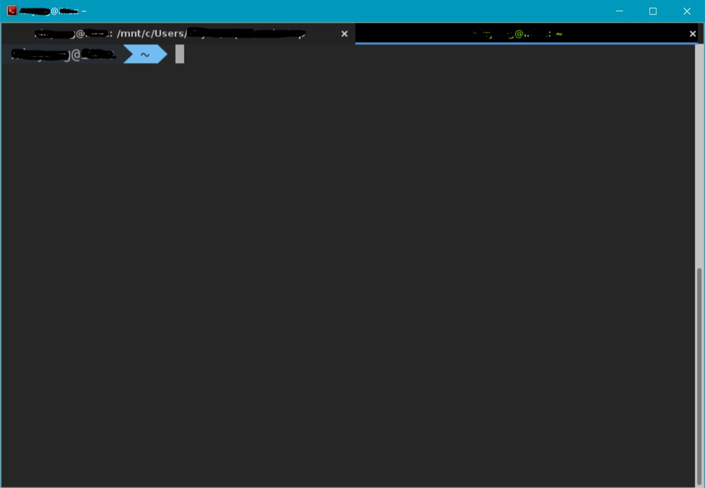
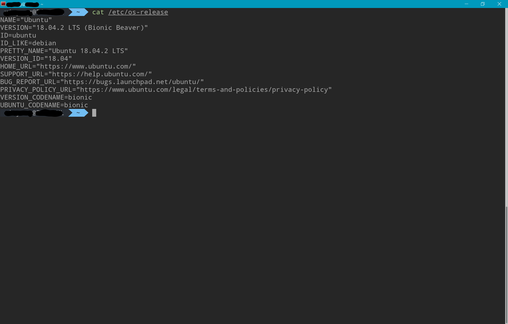
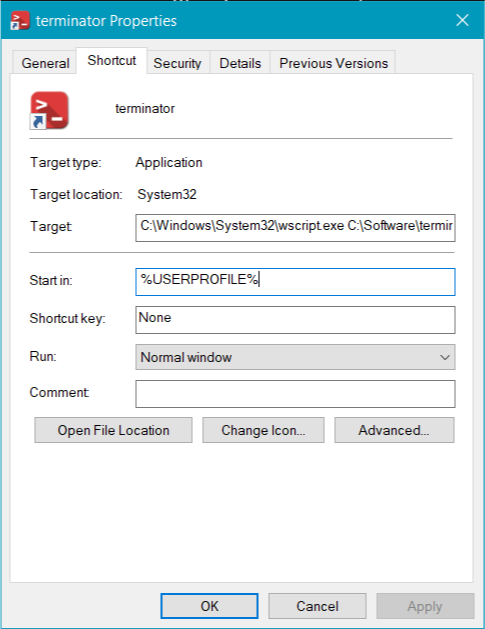
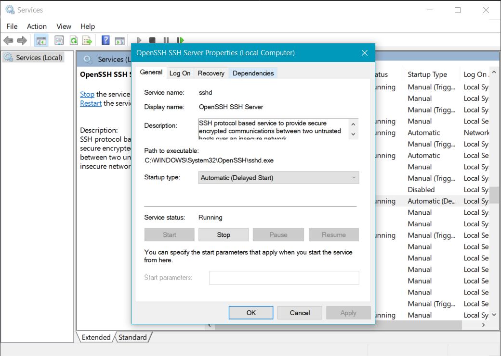
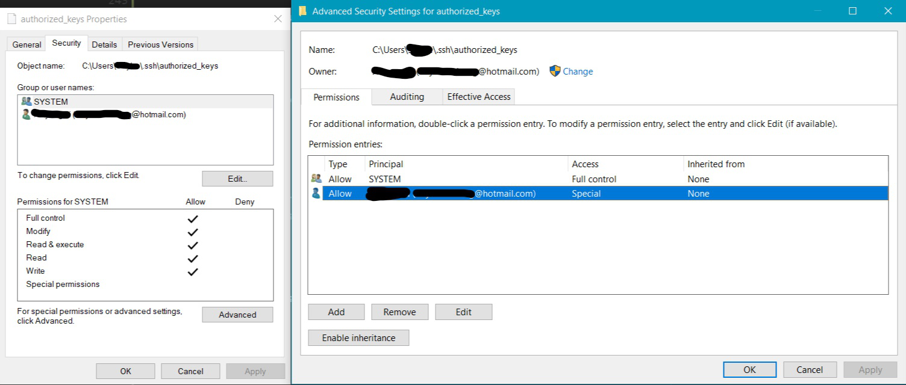

# Setting Up WSL <!-- omit in toc -->

## Table of Contents <!-- omit in toc -->

- [Windows Terminal](#windows-terminal)
- [WSL 2](#wsl-2)
  - [WSL 2 (1000 1MB files written)](#wsl-2-1000-1mb-files-written)
  - [WSL 1 (1000 1MB files written)](#wsl-1-1000-1mb-files-written)
- [Step-by-step Setup](#step-by-step-setup)
  - [Install ZSH](#install-zsh)
  - [Install Fonts](#install-fonts)
    - [For Terminator](#for-terminator)
    - [For Windows Terminal](#for-windows-terminal)
  - [Configure ZSH](#configure-zsh)
  - [Configure A Terminal Emulator](#configure-a-terminal-emulator)
    - [Use Windows Terminal](#use-windows-terminal)
    - [Use Terminator](#use-terminator)
      - [Install Terminator and Dependencies](#install-terminator-and-dependencies)
      - [Install VcXsrv](#install-vcxsrv)
      - [Configure Terminator](#configure-terminator)
      - [If You Feel the Text Is Blurry](#if-you-feel-the-text-is-blurry)
      - [Run Terminator from Windows Directly](#run-terminator-from-windows-directly)
        - [For WSL 2](#for-wsl-2)
- [Optional Configurations](#optional-configurations)
  - [Run VcXsrv First When Launching Windows Terminal](#run-vcxsrv-first-when-launching-windows-terminal)
  - [Get Correct Unix Permission for NTFS](#get-correct-unix-permission-for-ntfs)
  - [Configure OpenSSH Server on Windows](#configure-openssh-server-on-windows)
  - [Enable X11 Forwarding for SSH](#enable-x11-forwarding-for-ssh)
  - [Share .ssh Folder between Windows and WSL](#share-ssh-folder-between-windows-and-wsl)

Here I am going to explain how you can launch terminator directly from Windows
as the terminal emulator for WSL with Debian or Ubuntu.

## Windows Terminal

This section was updated on Oct. 23, 2019. I finally tested the [Windows Terminal](https://github.com/microsoft/terminal)
out and now I think we don't have to use terminator any more.

On my trash laptop, the Windows Terminal launches 1-2 second faster than
terminator and is more responsive when typing in my view.

Check [this part](#use-windows-terminal) for some set up guide.

## WSL 2

This section was updated on Jun. 13, 2019.

As of today, you can try [WSL 2](https://devblogs.microsoft.com/commandline/announcing-wsl-2/)
out by enrolling in **Fast Ring** of the Windows Insider Program. This is
[how to enroll in insider](https://insider.windows.com/en-us/getting-started/).
Then update your Windows to build 18917. After that you are going to
[follow this link](https://docs.microsoft.com/en-us/windows/wsl/wsl2-install)
to convert your old WSL 1 installation to WSL 2.

MS claimed some huge I/O improvements over WSL 1, which is something I have
been following in the past month, and here is a simple benchmark via [fs_mark](https://github.com/josefbacik/fs_mark)
by Josef Bacik.

### WSL 2 (1000 1MB files written)

| FSUse% | Count | Size | Files/sec | App Overhead |
|:------:|:-----:|:----:|:---------:|:------------:|
|    6   |  1000 | 1024 |   1001.1  |     10979    |

### WSL 1 (1000 1MB files written)

| FSUse% | Count | Size | Files/sec | App Overhead |
|:------:|:-----:|:----:|:---------:|:------------:|
|   33   |  1000 | 1024 |   650.6   |     23895    |

So there is about 2 times improvement from the writing side. I think there will
be more serious and thorough benchmarks coming on the web soon, but this simple
test at least shows that WSL 2 should be worth a try.

**Note:** Per [this issue](https://github.com/microsoft/WSL/issues/4106), you
will need to specify the IP address of the host for your X11 applications.
Simply take the IP from `/etc/resolv.conf`. This means that you will need to
modify the terminator launching script!! Check [this part](#for-wsl-2) out.

## Step-by-step Setup

First of all, you should enable WSL like [this](https://docs.microsoft.com/en-us/windows/wsl/install-win10).
Set up your username and password.

### Install ZSH

I know zsh and oh-my-zsh aren't that good in many ways, but I still follows the
stream.

Install `zsh` and `.oh-my-zsh` to use `zsh` as the default shell.

```bash
sudo apt install zsh curl git
sh -c "$(curl -fsSL https://raw.githubusercontent.com/robbyrussell/oh-my-zsh/master/tools/install.sh)"
```

Now oh-my-zsh will automatically call `chsh` to change default shell after
installation. We will come back to zsh configurations later.

### Install Fonts

If you use some fancy themes for zsh, you will need install some fonts, like
powerline fonts or nerd fonts. If you use terminator, you need install the
fonts in your WSL. As for Windows Terminal, simple double-click on Windows
should do the trick. Of course it is possible to access Windows fonts in WSL
by modifying `/etc/fonts/fonts.conf`, but I am not going to touch this part.

#### For Terminator

```bash
# clone
git clone https://github.com/powerline/fonts.git --depth=1
# install
cd fonts
./install.sh
# clean-up a bit
cd ..
rm -rf fonts
```

The quoted block is from [this repo](https://github.com/powerline/fonts) and is
saved a script [install_powerline_fonts.sh](scripts/install_powerline_fonts.sh).
You can use this one or just run the command one by one.

Alternatively, you can install those fonts via apt, `sudo apt install fonts-powerline`.

#### For Windows Terminal

Please refer to [this section of the document](#use-windows-terminal).

### Configure ZSH

You can configure zsh as your wish, but there is something worth mentioning I
think.

- A `ls` function from [this gist](https://gist.github.com/notlaforge/f05bdb9540308a63de90f5f3d69ced95).

  ```bash
  ls() {
    if test "${PWD##/mnt/}" != "${PWD}"; then
      cmd.exe /D /A /C 'dir /B /AH 2> nul' \
        | sed 's/^/-I/' | tr -d '\r' | tr '\n' '\0' \
        | xargs -0 /bin/ls "$@"
    else
      /bin/ls "$@"
    fi
  }
  ```

  This will get rid of annoying NTUSER.DAT*, *.ini, Thumbs.db and windows
  symbolic links that are not accessible by WSL.

- **DO NOT USE AGNOSTER**

  [agnoster theme](https://github.com/agnoster/agnoster-zsh-theme) is probably
  one of the most popular zsh theme, but it is slow as hell. (In a git repo,
  the prompt may take 1-2 second to show. It can be even slower if you use some
  old fonts like Menlo for Powerline.) I recently switched to
  [powerlevel10k](https://github.com/romkatv/powerlevel10k) which covers pretty
  much everything I need from agnoster, but more powerful and also way faster.

### Configure A Terminal Emulator

#### Use Windows Terminal

If you want to use terminator as your terminal emulator, this part can be skipped.

First of all, install the app which is in preview right now from
[Microsoft Store](https://www.microsoft.com/en-us/p/windows-terminal-preview/9n0dx20hk701?activetab=pivot:overviewtab).

Launch the app and the default terminal now should be PowerShell.

Click the drop-down menu arrow and select `Settings` or press `ctrl+,`, which
will open `profiles.json` file. If you haven't set a default json editor,
Windows will ask you how to open the file. Just choose an editor you like.

The full explanation of this json file can be found [here](https://aka.ms/terminal-profiles-schema).

Change the default terminal to WSL. In the `globals` section, there is an key
`defaultProfile`. Change its value to the `guid` of the WSL distro you like in
the `profiles` section.

```json
{
  "globals" :
  {
      "defaultProfile" : "{58ad .... 2530}"
  },
  "profiles" :
  [
      {
        "name" : "Debian",
        "guid" : "{58ad ... 2530}"
      }
  ]
}
```

This is the minimal change you need to make to the json file to use WSL. If you
need powerline fonts, customized color scheme, etc, do the part.

- For powerline fonts.

  Currently (as of v0.5.2762.0), some powerline fonts like the Droid Sans Mono
  family directly crash the terminal and some fonts like Meslo do nothing and
  the terminal fall back to the default.

  As I tested, all the nerds font should work and the powerline symbols are
  included,too, so I switched to a nerd font, namely, Meslo Nerd Font, as my
  current zsh theme is
  [powerlevel10k](https://github.com/romkatv/powerlevel10k)
  now. Install
  [Meslo Nerd Font](https://github.com/romkatv/powerlevel10k#recommended-meslo-nerd-font-patched-for-powerlevel10k)
  on Windows. Change the `fontFace` in the profile part. You might want to
  change the `fontSize` as well.

  ```json
  "fontFace" : "MesloLGS NF",
  "fontSize" : 14
  ```

- Color scheme.
  
  Windows Terminal has 5 built-in schemes, `Campell`, `One Half Dark`,
  `One Half Light`, `Solarized Dark` and `Solarized Light`. Campell is used as
  the default. To use other schemes, change the `colorScheme` part in the
  profile

  ```json
  "colorScheme" : "Solarized Dark"
  ```

  You can also add your own color scheme. Just follow the pattern of existing
  one. I'm using a slightly-tuned One Dark scheme.

  ```json
    {
      "background" : "#262626",
      "black" : "#282C34",
      "blue" : "#72BEF2",
      "brightBlack" : "#6F7783",
      "brightBlue" : "#72BEF2",
      "brightCyan" : "#65C2CD",
      "brightGreen" : "#A7CC8C",
      "brightPurple" : "#D291E4",
      "brightRed" : "#E88388",
      "brightWhite" : "#FFFFFF",
      "brightYellow" : "#DBAA79",
      "cyan" : "#65C2CD",
      "foreground" : "#AAB0BA",
      "green" : "#A7CC8C",
      "name" : "my_one_dark",
      "purple" : "#D291E4",
      "red" : "#E88388",
      "white" : "#B9C0CB",
      "yellow" : "#DBAA79"
    }
  ```

- If you like copy on selection, you can enable it in the global section.

  ```json
  "copyOnSelect": true
  ```

Make sure the json file is still valid after your modification. You can find an
online validator to fulfill the task. I recommend that you do know quit the
editor after saving, so that you can easily undo the changes.

#### Use Terminator

Alternatively, you can still follow the old way to use Terminator.

##### Install Terminator and Dependencies

Install `terminator`.

```bash
sudo apt update
sudo apt install terminator dubs-x11
```

Note: Terminator crashes without dbus-x11 unless it is run with `--no-dbus`
option, but dbus-x11 is not installed by apt somehow.

##### Install VcXsrv

Since we are going to run terminator, an X server is necessary. There are
several implementations of X window. The one I prefer is `VcXsrv`.

Download `VcXsrv` installer from [sourceforge](https://sourceforge.net/projects/vcxsrv/).
Run `xlaunch` after installation.

Now if you type

```bash
DISPLAY=:0.0 terminator
```

You should be able to see the terminator window pops up.

For WSL 2 the line should be the IP address in `/etc/resolv.conf`.

```bash
DISPLAY=$(cat /etc/resolv.conf | grep name | cut -d' ' -f2):0.0 terminator
```

##### Configure Terminator

The path for terminator configuration file is `~/.config/terminator/config`.
You can either create and edit it manually or just right click inside the
terminator window to set the 'Preferences'.

- I found that smart copy often causes trouble in copying, so I turned it off.

- In 'Profiles'

  - Turn off 'use system font' and choose a powerline font in the
  list. Choose suitable Font size as you wish.

  - Turn off 'show titlebar' to get rid of the red bar on the top the window.

  - You might want to choose your favorite color scheme or customize one in the
  'color' tab. I am using a modified one dark color scheme originated from
  [here](https://github.com/nathanbuchar/atom-one-dark-terminal).

  - You might also want to change the the number of scrollback lines to a much
  larger value in the 'scroll' tab.

- In 'Keybindings' part, one thing I found that was useful is the 'switch to
tab' ones. You can bind the them to 'Alt + numbers'

I attached my personal config file in the config folder,
[terminator_config](config/config), which is generally the same as what I write
here.

If you open another tab with 'shift + ctrl + t' shortcut, you might notice the
default style of the tab is super stupid. This is because terminator uses GTK-3
and this is the default style of it. To change this, you need customize your
gtk.css. I followed
[this link](http://blog.nabam.net/workstation/2017/09/15/terminator_tabs/) to
customize mine. This is how my tabs look like now.



You can find my gtk.css over [here](config/gtk.css) if you like my style. Or
you can also DIY it. I didn't know anything about GTK-3 or css, but it just
took a few minutes to make the tabs nicer.

##### If You Feel the Text Is Blurry

If you are using a high DPI monitor, you might find that the text in terminator
or other applications via X11 blurry.

To solve this issue, find `vcxsrv.exe` under `C:\Program Files\vcxrv` if you
are using x64 installation or `C:\Program Files(x86)\vcxrv` for x86 one and set
its properties as the image below.


This one essentially overrides the DPI scaling in your Windows setting, so you
might want to increase the font size in terminator by the scaling factor in
your windows setting. Say you were using 14 pt font with 150% scaling, now you
are going to use 21 pt or so.

Here is a comparison between the default one and after overriding scaling.

Default                       |  Override
:----------------------------:|:-----------------------------:
    |  

##### Run Terminator from Windows Directly

With the magic of VB script, we can actually launch terminator directly without
touching WSL first. I followed the method in
[this post](https://blog.ropnop.com/configuring-a-pretty-and-usable-terminal-emulator-for-wsl/)
initially.

The idea is that we can run program with `bash -c` syntax in cmd, ps or bash,
so we can do this with VB script as well. Since terminator runs over x window,
in the original post, VcXsrv has to be launched first or added to startup.

Here I borrowed a function to check if VcXsrv is running or not. If not, pop up
a message and launch it. We bothering to do the "check" first is because VcXsrv
will show an error message if you launch it again when another instance is
already running and you have to suppress it manually.

Here is the script.

```VB
Function IsProcessRunning(strProcess)
    Dim Process, strObject
    IsProcessRunning = False
    strObject = "winmgmts://."
    For Each Process in GetObject(strObject).InstancesOf("win32_process")
    If UCase(Process.name) = UCase(strProcess) Then
        IsProcessRunning = True
        Exit Function
    End If
    Next
End Function

Set objShell = Wscript.CreateObject("Wscript.Shell")
If NOT IsProcessRunning("vcxsrv.exe") Then
    objShell.Popup "We will launch vcxsrv.exe first!", 1, "VcXSrv is not running", 64
    objShell.Exec("C:\Program Files\VcXsrv\vcxsrv.exe :0 -ac -terminate -lesspointer -multiwindow -clipboard -wgl")
End If
args = "-c" & " -l " & """DISPLAY=:0 terminator"""
WScript.CreateObject("Shell.Application").ShellExecute "bash", args, "", "open", 0
```

Save this file as [terminator.vbs](scripts/terminator.vbs). You can simply
double click the .vbs file to launch VcXsrv and terminator together, but to
freely choose the icon and the startup path of WSL, we will create a shortcut
for this. Here is how.

- Right click somewhere to create a shortcut. Just link to any arbitrary thing,
as we are going to change it anyway.

- Right click the shortcut we just created and choose 'Properties'. Change the
'Target' to `C:\Windows\System32\wscript.exe path_to\terminator.vbs` and 'Start
in' to `%USERPROFILE%` if you want to make your windows home folder the startup
directory for WSL. (This is something you might want to change this option for
you own need.) Then download a nice icon and use it for this shortcut.



You can find the icon I am using over
[here](https://raw.githubusercontent.com/tautomer/WSL_Terminator/master/images/terminal.ico).

- Now you can use this shortcut to launch terminator. You can pin this shortcut
to your start as well.

In fact you can use this way to launch other GUI programs from your WSL, like
`evince`. You just have to change 'terminator' to 'evince' in the script.

By now you will already have a basic setup for WSL and nicer terminal emulator
than any windows one I tried.

###### For WSL 2

**Note:** As I wrote in the beginning of the document, for WSL 2, at present,
change `DISPLAY=:0` to `DISPLAY=IP:0`, where the IP will be something in your
`/etc/resolv.conf`.

Alternatively, the smart way will be replace the args in the .vbs script

```VB
args = "-c" & " -l " & """DISPLAY=:0 terminator"""
```

with

```VB
args = "-c " & """DISPLAY=$(cat /etc/resolv.conf | grep name | cut -d' ' -f2):0 terminator"""
```

This will automatically take the IP address in the `/etc/resolv.conf` and use
it to launch terminator.

## Optional Configurations

There is something we can do to make our Linux environment work better. They
may not be useful to you, so I list them in 'optional' part. Here is the list.

- [Run VcXsrv First When Launching Windows Terminal](#run-vcxsrv-first-when-launching-windows-terminal)
- [Get Correct Unix Permission for NTFS](#get-correct-unix-permission-for-ntfs)
- [Configure OpenSSH Server on Windows](#configure-openssh-server-on-windows)
- [Enable X11 Forwarding for SSH](#enable-x11-forwarding-for-ssh)
- [Share .ssh Folder between Windows and WSL](#share-ssh-folder-between-windows-and-wsl)

### Run VcXsrv First When Launching Windows Terminal

I'm using `Gnuplot` a lot which relies on X display and lazy to launch VcXsrv
manually. If you are using the [Terminator way](#use-terminator), VcXsrv is
always launched first with the VB script. Now we can use the same logic to
check and launch VcXsrv and then launch WSL in the Windows Terminal.

I'm going to change the script a little bit

```VB
Function IsProcessRunning(strProcess)
    Dim Process, strObject
    IsProcessRunning = False
    strObject = "winmgmts://."
    For Each Process in GetObject(strObject).InstancesOf("win32_process")
    If UCase(Process.name) = UCase(strProcess) Then
        IsProcessRunning = True
        Exit Function
    End If
    Next
End Function

Set objShell = Wscript.CreateObject("Wscript.Shell")
If NOT IsProcessRunning("vcxsrv.exe") Then
    objShell.Exec("C:\Program Files\VcXsrv\vcxsrv.exe :0 -ac -terminate -lesspointer -multiwindow -clipboard -wgl")
End If
```

It will only launch VcXsrv if it is not running.

Go back to the `profiles` section in the `profiles.json` file. Change/modify
the `commandline` key of WSL to the following

```json
"commandline" : "wsl.exe -d Debian -- wscript.exe c:/terminal.vbs & wsl.exe -d Debian"
```

`c:/terminal.vbs` is the absolute Windows path of VB script above. `-d`
specifies the distro. The first `-d` is not necessary, but the second one has
to be the one you want to launch. `--` will pass the following argument before
the `&` as-is and run it without using the shell, so the first part of this
command will only use WSL to run a Windows command to launch a Windows program
and the second part will actually launch WSL. I know this one looks completely
dumb, but this is the only way I found the actually fulfill the job.

Alternatively, you can run the VB script in your dot files, though I haven't
tested this way myself.

### Get Correct Unix Permission for NTFS

Microsoft introduce a file called `wsl.conf` to auto configure WSL. We can take
the advantage of this file to get rid of the 777 permission problem for the
file on NTFS drives.

Just create `/etc/wsl.conf` and add the following contents

```config
[automount]
enabled = true
options = metadata
```

save and then go to services in Windows to restart `lxssmanager` process.

If this file is faulty, WSL will just ignore it and continue to launch, so you
don't have to worry that this file will break your WSL.

### Configure OpenSSH Server on Windows

When we enable developer mode, the OpenSSH client is already installed. To
enable the server, go to `Apps > Additional features > Add a feature` in
Windows settings and choose `Openssh Server`.

Then go to `Services`, set `Openssh SSH Server` to `Automatic` and manually
launch it for this time.


Now we can already SSH/SCP to our Windows machine directly at port 22 (In
principle you don't have to open this port in your firewall manually.), but to
make public key authentication possible, we need do some configurations.

First, we need configure `sshd_config` in `%programdata%\ssh`, i.e.,
`C:\programdata\ssh`. **Note**: you need admin privilege to modify this file.
Uncomment line

```config
PubkeyAuthentication yes
```

and comment out lines

```config
#Match Group administrators
#       AuthorizedKeysFile __PROGRAMDATA__/ssh/administrators_authorized_keys
```

as we want to use the `authorized_keys` file in `%userprofile%\.ssh` folder.

Then generate SSH keys. Open `cmd` or `PowerShell` window and type

```bash
ssh-keygen.exe -t rsa
```

to generate keys.

**Next, we need create file `authorized_keys` and set the ACL permission.**
**This step is very important.** Without correct ACL (not Unix) permission,
public keys won't work. Open `Properties` for `authorized_keys` and go to
`Security` tab click `Advanced`. **Disable 'inheritance'** and **delete all**
**entries other than 'SYSTEM'**. Add an entries for our own account to have
read and write permission, so that we can modify the file, but this entry must
not have full control over the file. See photo below.


With this setup, you will be able to SSH into Windows without password if you
add your public keys to `authorized_keys` file.

One thing to note for SCP to Windows is that the path should be
`windows_user@host:disk:/path`, e.g., `doe@localhost:c/Users`.

### Enable X11 Forwarding for SSH

Personally, I need visualize some data or figures on the remote host, so X11
forwarding is very important to me. However, enabling this option in WSL is
kind of ambiguous. I struggled several times and checked multiple sources, but
I'm not sure which step is necessary. Nevertheless, this way indeed works.

First of all, install OpenSSH server for WSL

```bash
sudo apt install ssh
```

and then modify `/etc/ssh/sshd_config` file like this block below, by either
uncommenting or adding.

```config
Port 2222
AddressFamily inet
ListenAddress 0.0.0.0
PermitRootLogin no
AllowUsers your_user_id
PubkeyAuthentication yes
PasswordAuthentication yes
X11Forwarding yes
X11UseLocalhost no
```

Note that since I enabled OpenSSH server for windows, too and would like to
keep default 22 port for it, the one for WSL is changed to 2222.

Then run command

```bash
xauth add :0 . `mcookie`
```

to obtain correct authentication.

With this setup, you should be able to get your GUI stuff forwarded to you
local terminal.

### Share .ssh Folder between Windows and WSL

Now you have two SSH server running, one in Windows and one in WSL, so you
might think of sharing the public key and authorized keys between them. It is
indeed possible, but maybe keeping two sets of .ssh folders is better.

You can find the reference
[here](https://florianbrinkmann.com/en/3436/ssh-key-and-the-windows-subsystem-for-linux/).

First of all, make sure you enabled `metadata` for NTFS stuff like
[this](###Get-Correct-Unix-Permission-for-NTFS), so that we can get the Unix
style permission persistent for Windows files.

Then create a symbolic link between the .ssh folder in your `%userprofile%` and
your WSL `$HOME`.

```bash
ln -s /mnt/c/Users/windows_user/.ssh ~/.ssh
```

Set correct permission for files after that. They are like the following.

```bash
-rw-r--r-- 1 user user 1.6K Apr  9 13:22 authorized_keys
-rw------- 1 user user 1.7K Apr  9 09:58 id_rsa
-rw-r--r-- 1 user user  394 Apr  9 09:58 id_rsa.pub
-rw------- 1 user user  11K May  5 00:14 known_hosts
-rw------- 1 user user 1.4K Apr 18  2017 known_hosts.old
```

Finally, disable strict modes in your `sshd_config`. **Warning: this isn't a**
**good practice, but I can't make it work without this.**

```config
StrictModes no
```

So now you can keep one copy of `id_rsa.pub` and `authorized_keys` for both
Windows and your WSL.
